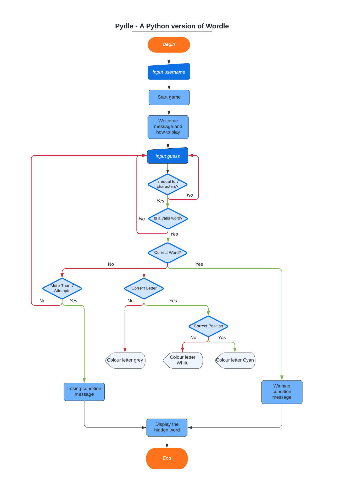

# Pydle CLI
A Python version of the popular game Wordle played in the command line
interface of the Python terminal. This version consists of a hidden word made
up of 7 characters long where the user will have 7 guesses to find the hidden
word. [Click here to play on the Heroku app](https://pydle-cli.herokuapp.com/)

## Table Of Contents

1. [How To Play](#how-to-play)
2. [Key Project Goals](#key-project-goals)
    1. [Site Owner Goals](#site-owner-goals)
    2. [User Goals](#user-goals)
3. [Information Gathering](#information-gathering)
    1. [Target Audience](#target-audience)
    2. [User Requirements](#user-requirements)
    3. [User Stories](#user-stories)
4. [Technical Design](#technical-design)
    1. [Flowchart](#flowchart)
    2. [Data Models](#data-models)
5. [Features](#features)
6. [Technology stack](#technology-stack)
    1. [Languages](#languages)
    2. [Frameworks and Tools](#frameworks-and-tools)
7. [Testing](#testing)
    1. [Validation](#validation)
    5. [User Story testing](#user-story-testing)
8. [Bugs and Fixes](#bugs-and-fixes)
9. [Deployment and Version Control](#deployment-and-version-control)
10. [Credits and Acknowledgements](#credits-and-acknowledgements)

## How To Play
* Enter name to begin playing
* There is a hidden word which the user must guess which consists of 7
characters in length.
* The user will have 7 attempts to guess the hidden word.
* The user must guess a valid 7 letter word and is unable to submit a random
entry of characters.
* If the guess is not equal to 7 letters then a prompt will display giving
feedback that the incorrect amount of characters was used.
* Begin with first guess. On submission of first guess, will display the users
entry as well as if the guess has any letters that matches to the hidden word.
* If the letter in the guessed word displays white: The user has guessed the
correct letter but in the wrong position.
* If the letter in the guessed word displays cyan: The user has guessed the
correct letter and is in the correct position.
* If the letter in the guessed word displays grey: The user has guessed an
incorrect letter that is not in the word.
* If all the letters display cyan: User has guessed the correct word and won.
* If the user is unsuccessful then the hidden word will display so that the
user can see what word they were trying to guess. Followed by a Game Over
message.
* To play again click the Run program message at the top of the terminal.

## Key Project Goals

### Site Owner Goals
* To create a simple and engaging game with a replayability factor.
* Users to test their vocabulary and possibly learn new words!
* Have familiarity with the game Wordle so that new users can easily pick up.
and start playing fairly intuitively.
* Provide the user with feedback on their entries and win/loss outcome.

### User Goals
* Pick up a game that is engaging and challenging to play.
* Simple intuitive design that isn't too confusing and low learning curve.
* Feedback on progress in the game with each guess.
* Want to know what the winning outcome would have been if unsuccessful.
* Replayability factor that can be played multiple times without having the
same word consistently appear.

## Information Gathering

### Target Audience
* The casual gamer who likes to pick up a game to play when bored.
* Education sector as a tool for learning vocabulary and spelling.
* Workers who are looking to play a simple and quick game on their breaks.

### User Requirements
* Have an engaging game to play which is fun and can be replayed.
* Intuitive to play without having a steep learning curve
* Gameplay to work as intended
* Feedback on progress within the game
* If the game was lost, to know what the winning outcome would have been.

### User Stories
No. | As a | I want to | so that
----|------|-----------|--------
1 | user | have an intuitive experience | i can easily play the game.
2 | user | have feedback as i play | i can see what the correct letters are.
3 | user | see the winning outcome | i can see what i was trying to guess if
not successful.
4 | user | be able to restart the game | i can play again if game ends or 
freezes.
5 | user | know that i am guessing valid words | i'm not wasting my guess 
attempts adding to my experience.
6 | site owner | provide a description on how to play | users who are not
familiar with the game Wordle will know how to play Pydle.
7 | site owner | give feedback of invalid guesses | it will avoid any
unecessary frustrations with users typing invalid words or words not of the
correct length without realising.
8 | site owner | display the hidden word on end of game | users can see what
word they were trying to guess if unsuccessful.
9 | site owner | feedback on remaining guesses | to increase the user 
experience so that they are able to see how many tries they have left before 
the game will finish.
10 | site owner | have valid Python code | no errors or bugs are returned to 
the user.

## Technical Design

### Flowchart
The Pydle flowchart can be seen below. It was created using Lucid Charts.

Pydle Flowchart

### Data Models

## Features

## Technology Stack

### Languages

### Frameworks and Tools

## Testing

### Validation

### User Story Testing

## Bugs and Fixes

## Deployment and Version Control

### Deployment

### Cloning

### Version Control

## Credits and Acknowledgements

### Credits

### Acknowledgements