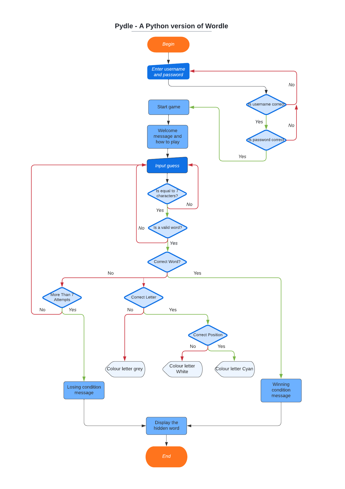
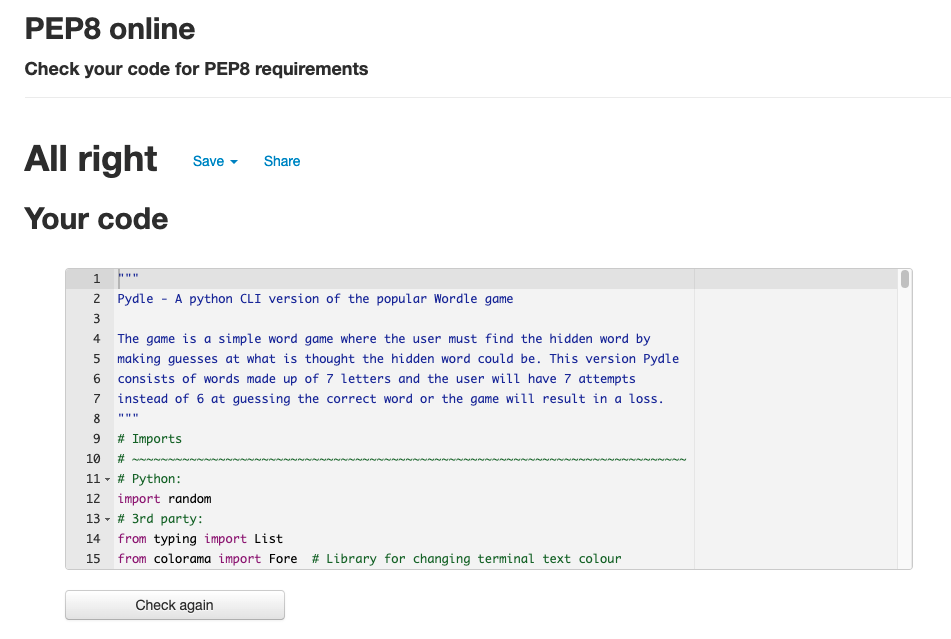

# Pydle CLI
A Python version of the popular game Wordle played in the command line
interface of the Python terminal. This version consists of a hidden word made
up of 7 characters long where the user will have 7 guesses to find the hidden
word. [Click here to play on the Heroku app](https://pydle-cli.herokuapp.com/)

## Table Of Contents

1. [How To Play](#how-to-play)
2. [Key Project Goals](#key-project-goals)
    1. [Site Owner Goals](#site-owner-goals)
    2. [User Goals](#user-goals)
3. [Information Gathering](#information-gathering)
    1. [Target Audience](#target-audience)
    2. [User Requirements](#user-requirements)
    3. [User Stories](#user-stories)
4. [Technical Design](#technical-design)
    1. [Flowchart](#flowchart)
    2. [Data Models](#data-models)
    3. [User Interface](#user-interface)
5. [Features](#features)
6. [Technology stack](#technology-stack)
    1. [Languages](#languages)
    2. [Frameworks and Tools](#frameworks-and-tools)
7. [Testing](#testing)
    1. [Validation](#validation)
    5. [User Story testing](#user-story-testing)
8. [Bugs and Fixes](#bugs-and-fixes)
9. [Deployment and Version Control](#deployment-and-version-control)
10. [Credits and Acknowledgements](#credits-and-acknowledgements)

## How To Play
* Enter name to begin playing
* There is a hidden word which the user must guess which consists of 7
characters in length.
* The user will have 7 attempts to guess the hidden word.
* The user must guess a valid 7 letter word and is unable to submit a random
entry of characters.
* If the guess is not equal to 7 letters then a prompt will display giving
feedback that the incorrect amount of characters was used.
* Begin with first guess. On submission of first guess, will display the users
entry as well as if the guess has any letters that matches to the hidden word.
* If the letter in the guessed word displays white: The user has guessed the
correct letter but in the wrong position.
* If the letter in the guessed word displays cyan: The user has guessed the
correct letter and is in the correct position.
* If the letter in the guessed word displays grey: The user has guessed an
incorrect letter that is not in the word.
* If all the letters display cyan: User has guessed the correct word and won.
* If the user is unsuccessful then the hidden word will display so that the
user can see what word they were trying to guess. Followed by a Game Over
message.
* To play again click the Run program message at the top of the terminal.

## Key Project Goals

### Site Owner Goals
* To create a simple and engaging game with a replayability factor.
* Users to test their vocabulary and possibly learn new words!
* Have familiarity with the game Wordle so that new users can easily pick up.
and start playing fairly intuitively.
* Provide the user with feedback on their entries and win/loss outcome.

### User Goals
* Pick up a game that is engaging and challenging to play.
* Simple intuitive design that isn't too confusing and low learning curve.
* Feedback on progress in the game with each guess.
* Want to know what the winning outcome would have been if unsuccessful.
* Replayability factor that can be played multiple times without having the
same word consistently appear.

## Information Gathering

### Target Audience
* The casual gamer who likes to pick up a game to play when bored.
* Education sector as a tool for learning vocabulary and spelling.
* Workers who are looking to play a simple and quick game on their breaks.

### User Requirements
* Have an engaging game to play which is fun and can be replayed.
* Intuitive to play without having a steep learning curve
* Gameplay to work as intended
* Feedback on progress within the game
* If the game was lost, to know what the winning outcome would have been.

### User Stories
No. | As a | I want to | so that
----|------|-----------|--------
1 | user | have an intuitive experience | i can easily play the game.
2 | user | have feedback as i play | i can see what the correct letters are.
3 | user | see the winning outcome | i can see what i was trying to guess if not successful.
4 | user | be able to restart the game | i can play again if game ends or freezes.
5 | user | know that i am guessing valid words | i'm not wasting my guess attempts adding to my experience.
6 | site owner | provide a description on how to play | users who are not familiar with the game Wordle will know how to play Pydle.
7 | site owner | give feedback of invalid guesses | it will avoid any unecessary frustrations with users typing invalid words or words not of the correct length without realising.
8 | site owner | display the hidden word on end of game | users can see what word they were trying to guess if unsuccessful.
9 | site owner | feedback on remaining guesses | to increase the user experience so that they are able to see how many tries they have left before the game will finish.
10 | site owner | have valid Python code | no errors or bugs are returned to the user.

## Technical Design

### Flowchart
The Pydle flowchart can be seen below. It was created using Lucid Charts.

Pydle Flowchart

### Data Models
The Pydle application makes use of both functional and object orientated 
programming in forms of classes, decorators, methods, functions, attributes,
for and while loops as well as lists and dictionaries. 

Two classes were used within the project for the logic of the game as well as
the rules for the letters for the hidden word with booleans and were defined 
as 'Pydle' for the game logic and 'CharacterRule' for the letter rules. 

Lists and dictionaries were used to grab the list of valid words as well as 
a list of words to be used for the hidden words and manipulate them so that
the index of the letters within those words could be iterated.

For and While loops were used in order to iterate through the list of words 
to be used for the hidden word as well as the letters within the words as an 
index for validation displaying whether a word/letter was correct or not.

The run.py file houses the main function of the game as well as the interface
functions of the game. This was chosen to be the main file in which the game
would be run from, importing the logic and rules from the other .py files.

The pydle_logic.py file houses the game logic within the class: Pydle. This
was chosen to be seperated from the main run.py file in order to make it
easier to be able to read and a less confusing structure. It allowed me to 
then import this class into the main file without having to worry about it's
position within the structure of the file.

The character_rule.py file is where the class: CharacterRule is held which
defines the rules for if the letters are in the hidden word or in the correct
position. It is imported into the main run.py file and referred to within the
functions. It was decided to have its own seperate file for ease of reference
as well as not having to worry about it's position within the structure of the
file.

Two .txt files were used. valid_words.txt holds a list of all the possible 7
letter words that are valid real words. This file was used for validation
purposes so that the user wasn't able to guess words that do not exist or type
random letters to cheat the game. The word_list.txt is a list of 500 of the
most commmon 7 letter words and is used for choosing a random word from this
list for the hidden word that the user must guess.

### User Interface
The user interface makes use of a simple 'lo fi' aesthetic and select colours
in order to be able to provide the user with validation feedback on their 
inputs, such as invalid words or incorrect word lengths typed, result in an 
error message displayed in red. Positive results such as guessing the correct 
hidden word results in a green message to the user. Colours were also used in 
order to display whether the user has guessed the correct letter within the 
word or if the correctly guessed letter is in the right position. Underscores
were used to display the length of the characters under the users guess and 
so that they could also have visual feedback of remaining guesses as well as
having textual feedback.

## Features
* Username input
* How to play
* guess word input
* Word and character length validation
* Tips section giving concise reminder of what the interface colours mean
* Interface displaying guessed word and remaining attempts with colours
* Win/Loss conditions message and game over message

## Technology Stack

### Languages
* Python 3

### Frameworks and Tools
* Git
* GitHub
* Gitpod
* Heroku
* Lucidchart
* VS code Pylint
* PEP8online python linter

## Testing

### Validation
The Python code for each .py file was validated using the PEP8 Online
Validation Service. The main run.py file returned with zero errors or
warnings. The pydle_logic.py file and the character_rule.py file both
returned with the E701 - multiple statements on one line (colon) weak 
warning code. When googling this warning code it appears that it could 
be a bug and has been reported by multiple users.

run.py

pydle_logic.py

character_rule.py

VS code Pylint

### User Story Testing
* to complete

## Bugs and Fixes
I had an issue over the course of a couple days trying to get the pygame module to work. After logging tutor support realised that this module wouldn't work with the terminal and ended up scrapping the repository and starting fresh. The project was met with multiple bugs during the process and some of which were documented and shown below.

BUG | FIX
Class object was being printed in the terminal as an object instead of the constructor instance name. | Changed the f-string from '{pydle}' to {pydle.hidden_word}. This then printed the word letters rather than an object name.
Index out of range - tried to access index of guessed word but no element. | Check if length > 0 and last guess == hidden_word.
Type error '>' not supported between instances of 'method' and 'int'. | Add decorators to the method then used an int return annotation.
Syntax error closing parenthesis ']' does not match opening parenthesis '('. | Deleted the type in error of ']' that was stopping code from running.
Index error: string index out of range. | In the for loop for 'guess_attempt' function, 'word[i]' wasn't put into an argument of the CharacterRule class.
On trying to colour the result of the user guess. Colour isn't working and instead was producing blank lines. | I had referred to the wrong parameter of 'color_guess' instead of 'guess_result' on changing this fixed the terminal output.

## Deployment and Version Control

### Deployment
The Pydle application was deployed from Github using Heroku app. In order to
deploy your application please complete the following:

1. Create an account at heroku.com
2. Create a new app 
3. Add the app name and your region
4. Click on create app
5. Go to "Settings"
6. Under Config Vars, add the key: PORT and the value: 8000.
7. Go to "Deploy" and at "Deployment method", click on "Connect to Github"
8. Enter your repository name and click on it when it shows below
9. Choose the branch you want to buid your app from
10. If desired, click on "Enable Automatic Deploys", which keeps the app up to date with your Github repository

### Cloning
If you wish to clone the repository you can do so by [clicking here](https://docs.github.com/en/repositories/creating-and-managing-repositories/cloning-a-repository) or completing the following:
1. Locate and click on the Code button at the top of the directory within the GitHub repository
2. This will dropdown the option of HTTPS, SSH and GitHub CLI and the option to open with GitHub Desktop or Download ZIP. Choose the option you prefer and click the copy to clipboard button
3. Open the Git bash terminal
4. Choose the working directory location to where you wish to have the cloned directory.
5. Type "git clone" followed by pasting the URL you copied in step 2.
6. Press Enter to complete and create your local clone.

### Version Control
[Click here](https://github.com/hardingrichard/ci-pp3-pydle/commits/main) to explore the history of the creation process and see what the code looked like at different points in time and what changes were made. Regular commits were made in order to make it easier to view the thought process during the creation of the application and readme and also have saved back up points to avoid loss of work in case of any serious malfunctions.

## Credits and Acknowledgements

### Credits
* Add credits information here.

### Acknowledgements
I would like to give a moment to thank:
* My parents for testing the application as first time users to see if they found the game intuitive.
* My mentor Mo Shami for his time, guidance and feedback during our meetings.
* Tutor support for answering a query that had me stuck for a couple of days.
* My cohort on slack for responding to questions.